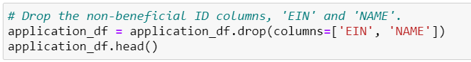
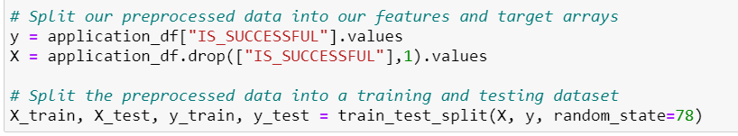
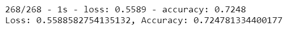
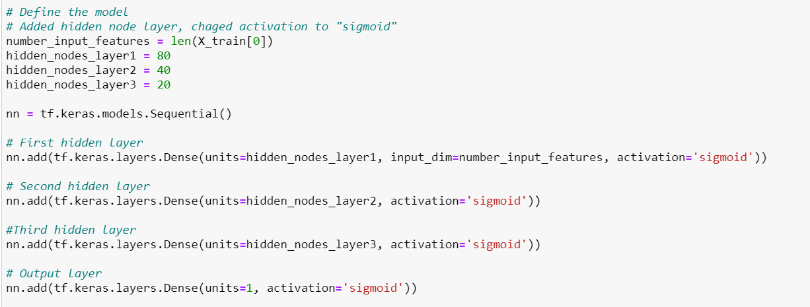
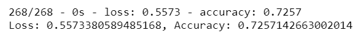
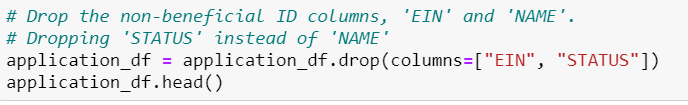
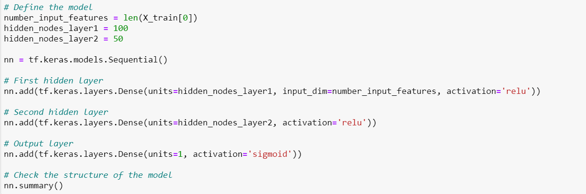
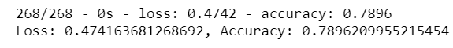
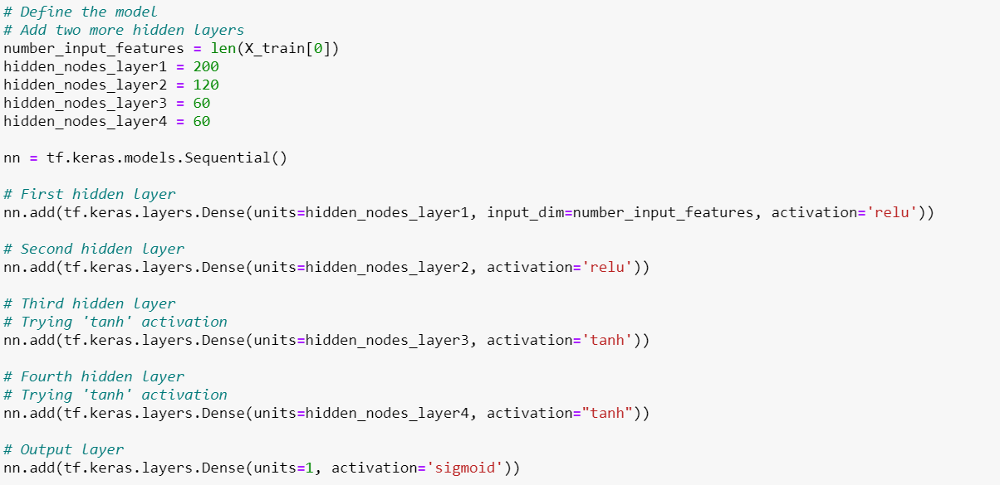
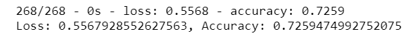

# Neural_Network_Charity_Analysis
## Overview 
A binary classifier that is capable of predicting whether applicants will be successful if funded by Alphabet Soup was created. Alphabet Soup’s business team sent a CSV containing more than 34,000 organizations that have received funding from Alphabet Soup over the years. This file contained several columns that captured data about each organization, such as identification columns, application type, special considerations, income classification, amount of funding requested, if the money was used effectively, and many more.

## Resources
Data Source: [charity_data.csv](https://github.com/k-wrenn/Neural_Network_Charity_Analysis/blob/main/Resources/charity_data.csv)

Software: Python, Jupyter Notebook

## Results
### Data Preprocessing
The target variable for this analysis is IS_SUCCESSFUL. Variables considered features include APPLICATION_TYPE, AFFILIATION, CLASSIFICATION, USE_CASE, ORGANIZATION, STATUS, INCOME_AMT, SPECIAL_CONSIDERATIONS, and ASK_AMT.

There are two variables which are neither targets nor features: EIN and NAME. These variables were removed from the DataFrame with the following code:

Once the data was preprocessed, it was split into feature and target arrays. Then, it was split into a training and testing dataset to compile train and evaluate the model.

### Compiling, Training, and Evaluating the Model

For the initial model, two hidden layers were used. The general rule when calculating the number of neurons in the hidden layer is two to three times the number of inputs. Becuase there were just over 40 inputs, the first layer had 80 neurons while the second layer contained 30. This first model used relu functions for the hidden layers to help standardize and simplify the output while sigmoid was used for the output layer so the model could classify with a 0 or 1 and the optimizer used was adam. Unfortunately, the initial model did not produce a target performance of 75% or greater.

Optimization attempts were made to try to achieve the target model performance of 75% of greater. 

In the first optimization attempt, no changes were made to the target or feature variables from the original model. The number of neurons in the second layer was upped to 40 and a third hidden layer was added with 20 neurons. The activation for all hidden layers was changed from relu to sigmoid.

These changes did not increase the accuracy to over 75%

The second optimization attempt, instead of removing 'NAME' from the dataset, 'STATUS' was removed.

The number of neurons in the first and second hidden layer were increased to 100 and 50 respectively. The hidden layer activations were also changed back to relu, while the output layer remained sigmoid.

This model achieved a traget accuracy of greater than 75%, with a nearly 80% accuracy.

A third optimization attempt was made to again try to achieve the target accuracy score. The target and feature variables from the very first model were used. Instead of 2 hidden layers, 4 were used. The first layer contained 200 neurons, the second 120, third 60, and fourth 60. The activation for the first two hidden layers was relu, while the tanh activation was used for the third and fourth and sigmoid for the output later.

This model only achieved a 72% accuracy.

## Summary
From the results shown above, the inclusion of 'NAME' as a variable had a greater effect on the model's accuracy than the number of hidden layers, number of neurons, or type of activation used.

An analysis using the Random Forest classifier should be done to help solve the classification problem. Random Forest models can better handle outliers and is less likely to overfit.
